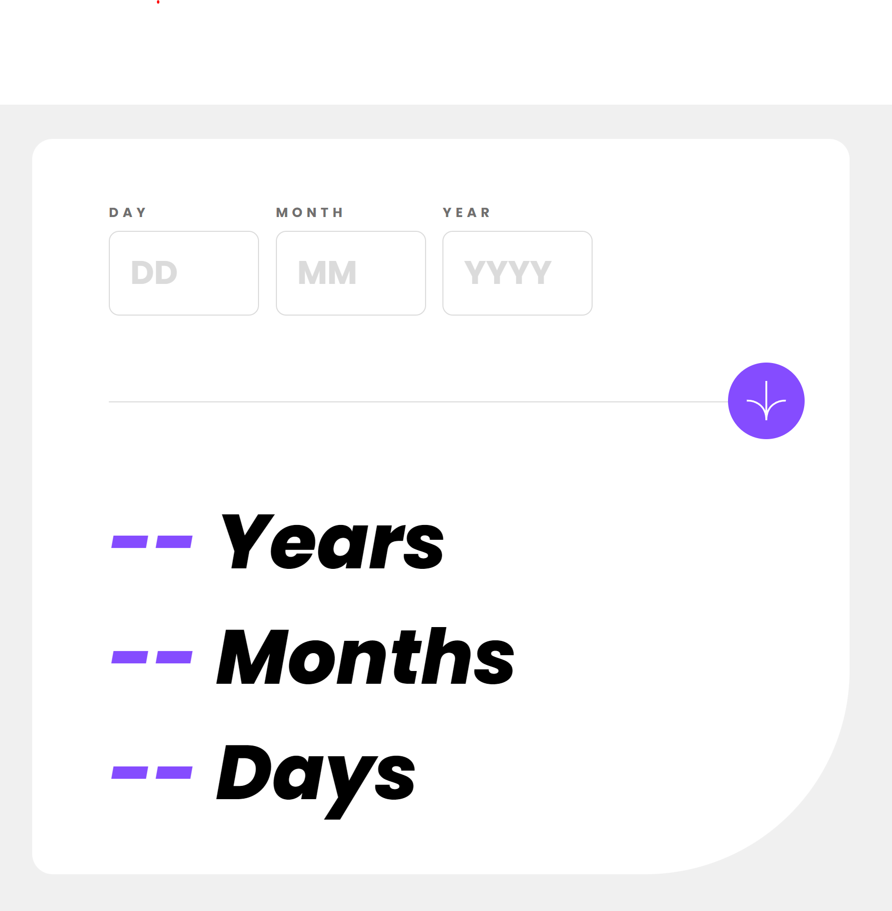
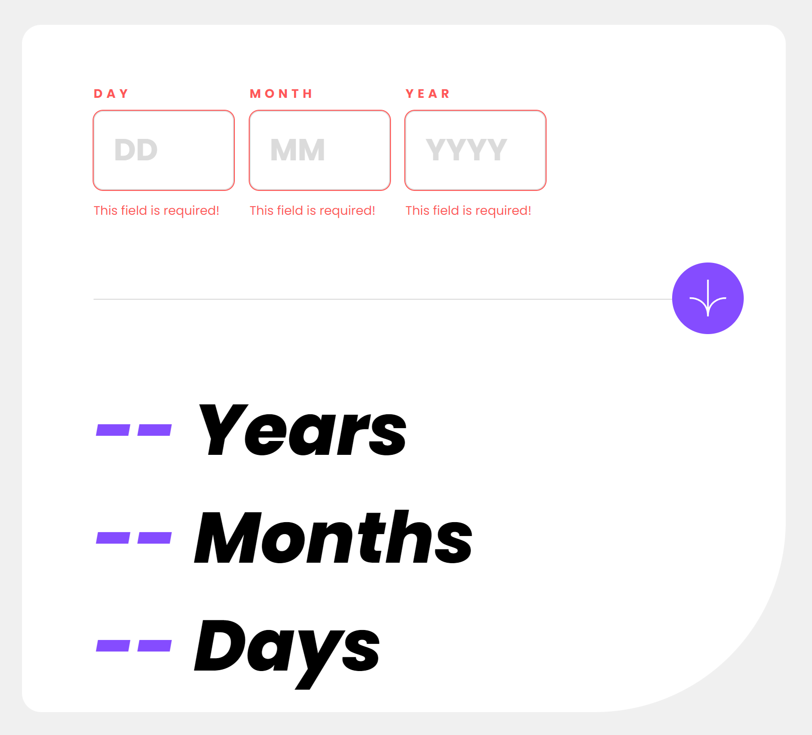
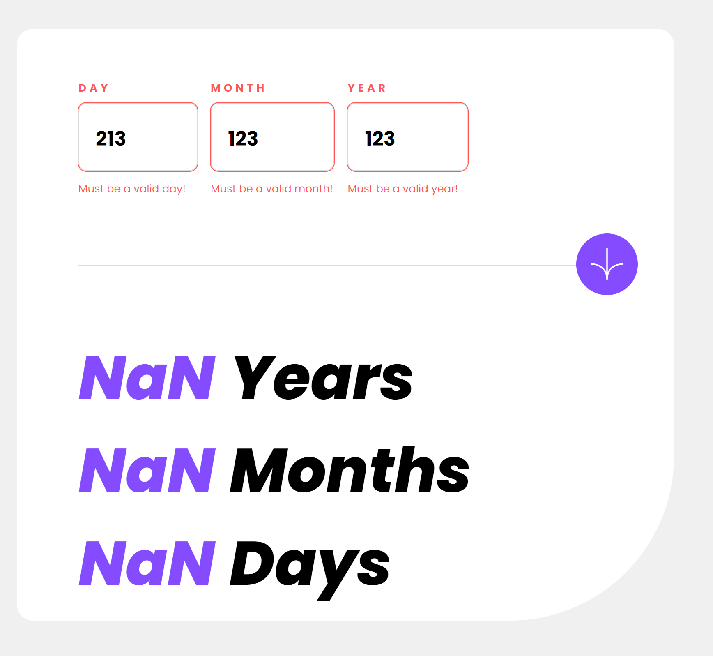
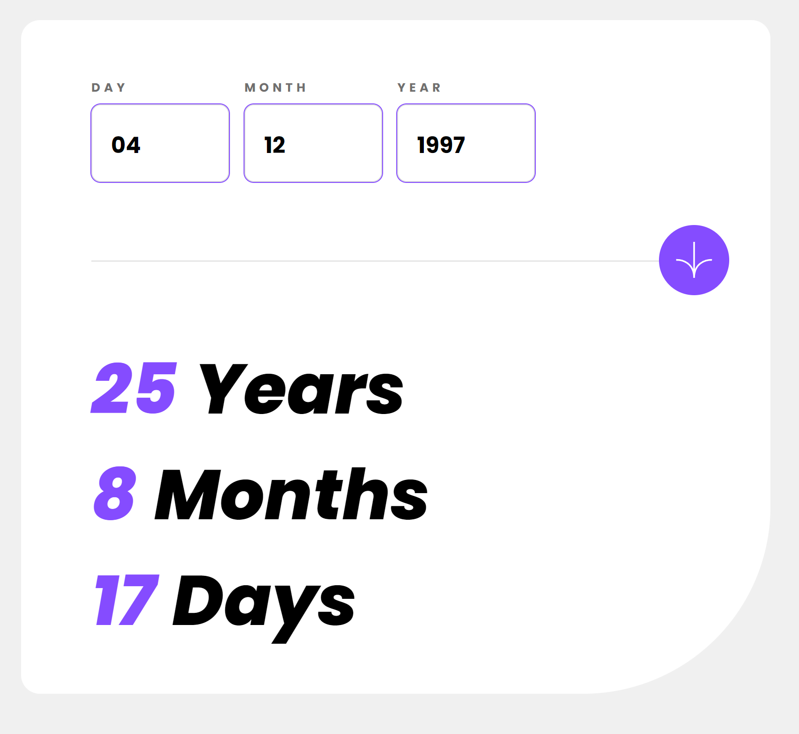
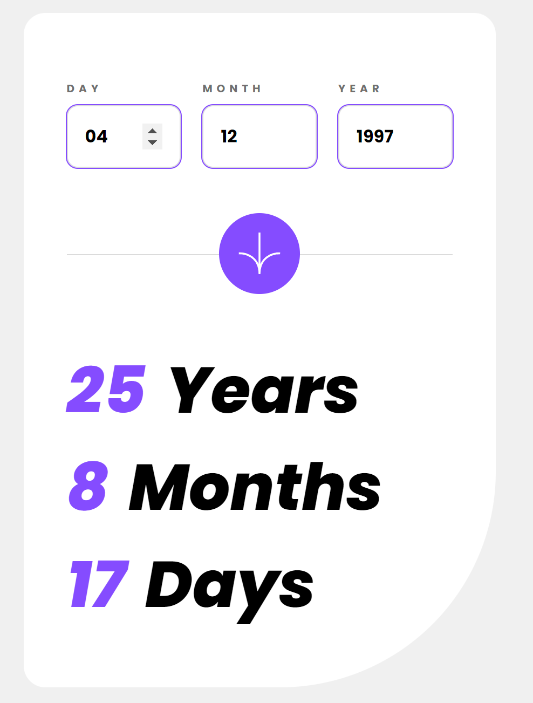

# Frontend Mentor - Age calculator app solution

This is a solution to the [Age calculator app challenge on Frontend Mentor](https://www.frontendmentor.io/challenges/age-calculator-app-dF9DFFpj-Q). Frontend Mentor challenges help you improve your coding skills by building realistic projects.

## Table of Contents

- [Overview](#overview)
  - [The Challenge](#the-challenge)
  - [Screenshot](#screenshot)
  - [Links](#links)
- [My Process](#my-process)
  - [Built With](#built-with)
  - [What I Learned](#what-i-learned)
  - [Continued Development](#continued-development)
  - [Useful Resources](#useful-resources)

## Overview

This is a simple accordion challenge from frontend mentor. It uses the following technologies, html, scss and vanilla javascript.

### The Challenge

app should be able to:

- Validate if all fields have a value
- Validate if each field contains a usable value

Users should be able to:

- To type in the respective input columns
- Generate Age

### Screenshot







### Links

- Solution URL: https://gentle-marshmallow-d5605d.netlify.app/

## My Process

I tackled this challenge through a systematic approach. I began by establishing the necessary HTML structure for the application. Subsequently, I focused on crafting the mobile view of the application, ensuring a responsive and user-friendly design. As I moved forward, I devoted my attention to refining the styling for the desktop view, striving for a polished and cohesive appearance.

To ensure the functionality of the application, I conducted research on how to obtain a date object, a crucial component of the logic I intended to implement using JavaScript. This research phase enabled me to gain a comprehensive understanding of the concept before seamlessly integrating it into the codebase.

### Built With

- HTML5 and Semantic Markup
- SCSS with Flexbox and Media Queries
- Vanilla JavaScript for Interactivity

### What I Learned

During this project, I learned how to create a responsive age calculator using HTML, SCSS, and JavaScript. Some key takeaways include:

- Implementing a mobile-first approach in design and development
- Utilizing flexbox for layout and alignment of elements
- Enhancing user interactivity with JavaScript event listeners
- Managing content visibility through class toggling
- Usage of foreach array array
- Understadning how a new date object can be created to retrieve the day, month and current year

I am most proud of figuring out how validate if the input field is valid first before checking if the day, month and year values are valid

```javascript
// Add a click event listener to the button
btn.addEventListener("click", function () {
  // Validate all input elements before proceeding
  if (!validateAllInputs()) {
    return; // Stop execution if any input is invalid
  }

```

I am also proud on identifying how I can add classes to elements next to it using the previous and next elementsibling methods.

```javascript
 inp.classList.add("success-outline");
  inp.classList.remove("error-outline");
  inp.previousElementSibling.classList.remove("error");
  inp.nextElementSibling.textContent = "";
```

### Continued Development

I omitted the implementation of logic for testing the existence of the complete user date value. I faced uncertainty about the methods to validate the authenticity of the full date input.

Moreover, I haven't yet incorporated a mechanism to handle situations where the provided values are invalid. Currently, when an incorrect value is entered, "NAN" appears, without a safeguard to prevent its display when inaccuracies occur.

Addressing these aspects could be seamlessly integrated into my ongoing development process. By refining the logic to detect valid input and devising a strategy to handle invalid values, I aim to enhance the overall robustness and user experience of the application in the near future.

### Useful Resources

- https://www.w3schools.com/jsref/jsref_foreach.asp
- https://developer.mozilla.org/en-US/docs/Web/API/Element/nextElementSibling
- https://www.scaler.com/topics/get-current-date-in-javascript/
